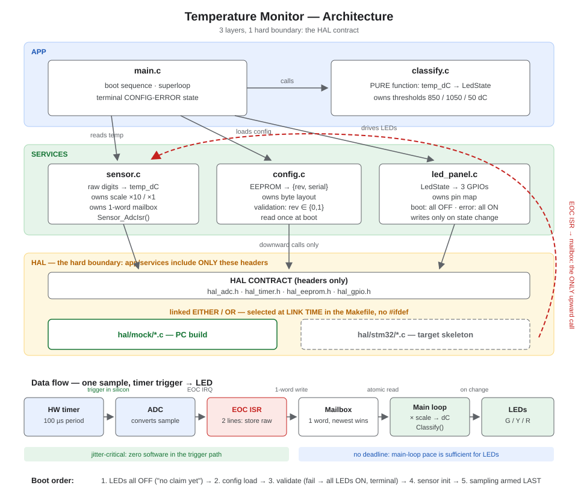

# Temperature Monitor

Bare-metal temperature monitoring device: ADC sensor sampled every 100 µs with
very low jitter, classified into OK / Warning / Critical, shown on 3 LEDs
(G < 85.0 °C, Y ≥ 85.0 °C, R ≥ 105.0 °C or < 5.0 °C). Two hardware revisions
(Rev-A: 1.0 °C/digit, Rev-B: 0.1 °C/digit) selected by an EEPROM config byte.
Written in C as a PC demonstration with mocked hardware interfaces.

## Architecture



## Build & run

```bash
make run     # builds and runs the demo
```

Windows host build: requires MinGW gcc and GNU make (the Makefile uses cmd.exe
commands). Everything builds with `-Wall -Wextra -Werror`.

The demo runs three scenarios (Rev-A, Rev-B, corrupt EEPROM) through a scripted
temperature profile `20.0 → 84.9 → 85.0 → 104.9 → 105.0 → 60.0 → 5.0 → 4.9 →
20.0 °C` and prints time-stamped LED pin transitions. Deterministic by design —
the output is diff-checkable and doubles as a regression test.

## Layout

```
src/        main.c (boot sequence, demo superloop), classify.c (PURE classifier, owns thresholds)
services/   sensor.c (raw→deci-°C, mailbox, ISR), config.c (EEPROM layout+validation), led_panel.c (pin map)
hal/        hal_*.h — the HAL contract (headers only)
hal/mock/   PC mock implementation (linked by this build)
hal/stm32/  target skeleton (reference only, never compiled here)
```

Verification is manual via the demo: its scripted profile is deterministic, so
the expected output (incl. the exact boundary transitions at 85.0/105.0/4.9 °C
and the absence of transitions at 84.9/104.9/5.0 °C) is diff-checkable.

## Assumptions

- ADC raw value is already "digits" per the spec scaling; no volts→°C transfer
  function is modeled.
- Config is read once at boot; revision is soldered hardware and cannot change
  at runtime.
- LED update rate is unconstrained (main-loop pace).
- Single core, no RTOS; one ISR + superloop is the entire concurrency model.